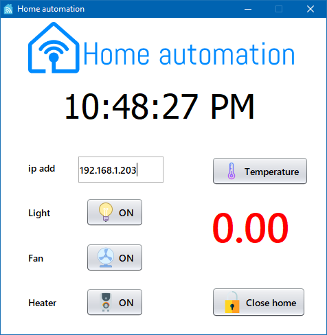
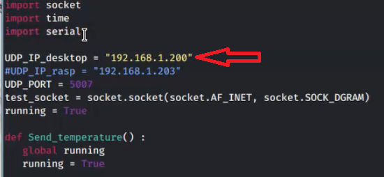
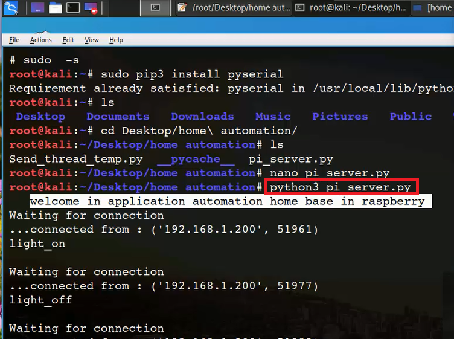

# home-automation-based-on-raspberry-pi-and-desktop-java-app
you can use your computer to switch on/off the appliances like the fan, heater ,lights and  monitor the temperature in real time. 
- the rar file contains all images and scripts and ready jar file in home automation based on raspberry pi\home automation desktop app\dist folder
- to run the jar file in the previous path you need to install java runtime environment
- you should setup the ip of destination (raspberry pi)

- to receive the data from the raspberry into your computer , setup the ip destination (computer)in the send_thread_temp file

- in the raspberry  pi lunch the pi_server scripts using the command python3 pi_server.py

- demonstration video :
- website bloog :
